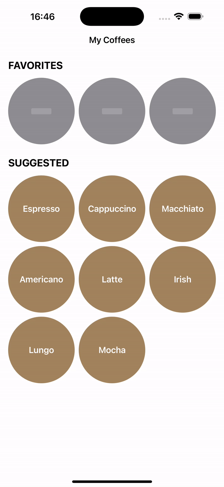

# My Coffees App

Hi! 👋

This is the sample app for the issue #33: [🔶 How the matchedGeometryEffect() saved the day 🦸‍♂️](https://www.ioscoffeebreak.com/issue/issue33) of the iOS Coffee Break, showcasing the benefits of animating your SwiftUI views with the Matched Geometry Effect.

 

  

Have a nice day,
 
Tiago
